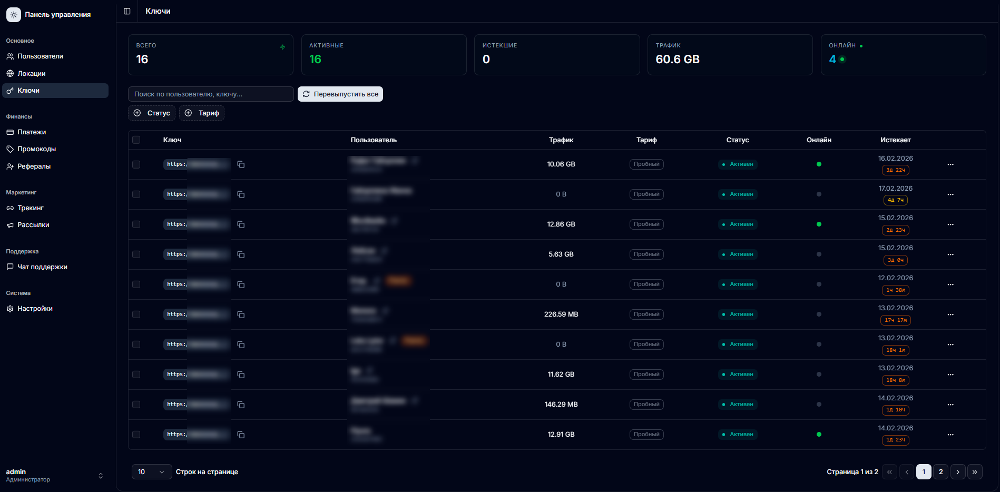
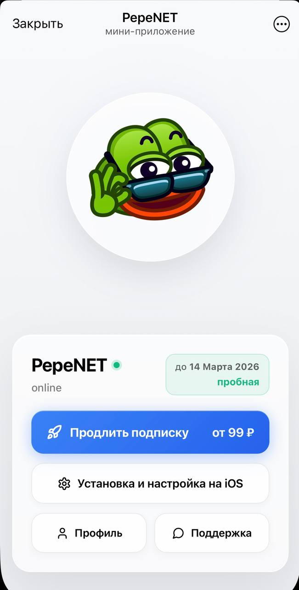

# VPN бот Telegram — готовая платформа с Mini App, админкой и приёмом оплаты

Готовое решение для запуска собственного VPN-сервиса в Telegram. Не просто бот с текстовыми командами — полноценная платформа: Telegram Mini App для клиентов, React-админка для владельца, 4 платёжные системы, AI-бот поддержки, мониторинг серверов.

**[Подробнее на сайте →](https://monexo-stack.github.io/tmavpn-site/)**

---

<p align="center">
  
</p>

<p align="center">
  
</p>

---

## Что внутри

### Telegram Mini App
- Статус подписки, выбор тарифа, выбор количества устройств
- Оплата через **Telegram Stars, ЮKassa, CryptoBot, ЮMoney**
- Визард настройки VPN — определяет устройство, отправляет конфиг deeplink-ом
- Пошаговые инструкции под Android, iOS, Windows, macOS, Linux
- Реферальная программа — бонусные дни за приглашение друга
- Тёмная и светлая тема из Telegram, glassmorphism-дизайн

### React-админка
- **Дашборд** — юзеры, выручка, MRR, графики по часам/дням/месяцам
- **Пользователи** — поиск, фильтры, антибот-скоринг, массовые действия, CSV
- **VPN ключи** — онлайн-статус, трафик, таймер истечения по WebSocket
- **Мониторинг серверов** — CPU, RAM, диск, трафик, спидтест, перезагрузка
- **Платежи** — тост-уведомления, график выручки, Telegram Stars с конвертацией
- **Рассылки** — сегментация аудитории, промокоды, трекинг-ссылки с аналитикой
- **Чат поддержки** — диалоги, медиа, AI-бот + эскалация на админа
- **Настройки** — 8 вкладок: бот, тарифы, платёжки, рефералы, уведомления, AI, домен, логи

### Бэкенд
- Интеграция с **3x-ui** по API — VLESS, Reality, XTLS
- **AI-поддержка** — OpenAI-совместимый, данные юзера в контексте, детектор злости
- **Агент мониторинга** — HTTP heartbeat + WebSocket + HTTP-поллинг
- Автоотключение при истечении подписки, переиспользование ключей при продлении

## Стек

| | Технология |
|---|---|
| Бэкенд | Python 3.11, FastAPI, SQLAlchemy, aiogram |
| Фронтенд | React, TypeScript |
| База данных | PostgreSQL, Redis |
| VPN | 3x-ui / XRay (VLESS, Reality) |
| AI | OpenAI API |
| Деплой | Docker, docker-compose, nginx, Alembic |

## Сравнение с аналогами

| | VPN боты | Marzban / Remnawave | Эта платформа |
|---|---|---|---|
| Интерфейс клиента | Текст в боте | — | ✅ Mini App |
| Админ-панель | Бот-команды | Панель сервера | ✅ React + аналитика |
| Мониторинг | — | Базовый | ✅ Агент + WebSocket |
| AI-поддержка | — | — | ✅ OpenAI |
| Платёжки | 1-2 | — | ✅ 4 системы |
| Рассылки | — | — | ✅ С сегментацией |
| Трекинг-ссылки | — | — | ✅ С аналитикой |
| Антибот | — | — | ✅ Скоринг |

## Что входит

- Бэкенд — ~122 файла Python (FastAPI, SQLAlchemy, aiogram)
- Админка — ~84 компонента React/TypeScript
- Mini App — ~19 компонентов React/TypeScript
- Агент мониторинга серверов
- Docker-файлы и docker-compose
- Конфигурация nginx
- Миграции базы данных (Alembic)
- Инструкция по установке
- Помощь с первым запуском

## Деплой

```bash
docker compose up -d
```

Визард при первом запуске спрашивает домен, токен бота, ключи платёжных систем.
Требования: VPS с Ubuntu 22.04+, 2GB RAM, домен.

## Демо

Попробуйте Mini App прямо сейчас: **[@pepenetbot](https://t.me/pepenetbot)**

## Цена

**19 000 ₽** — полный исходный код + помощь с установкой.
Одноразовый платёж, без подписок. Владеете кодом полностью.

## Связь

**Telegram:** [@by_monexo](https://t.me/by_monexo)

**[Подробнее на сайте →](https://monexo-stack.github.io/tmavpn-site/)**
